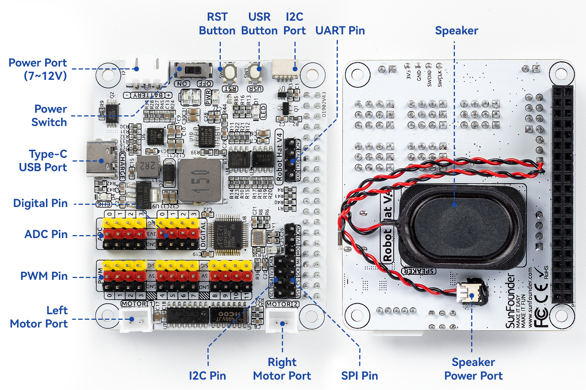
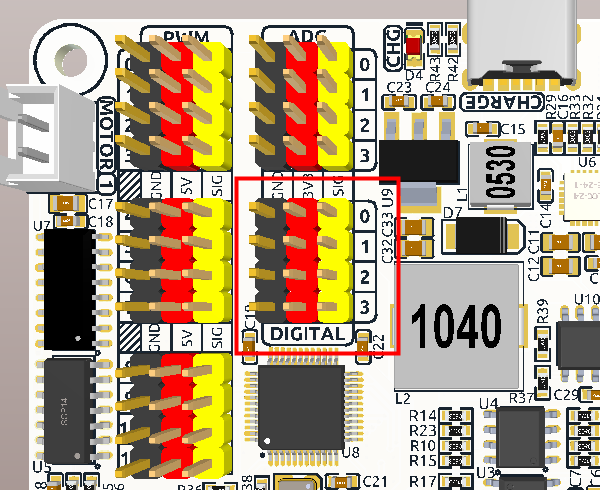
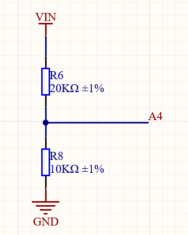
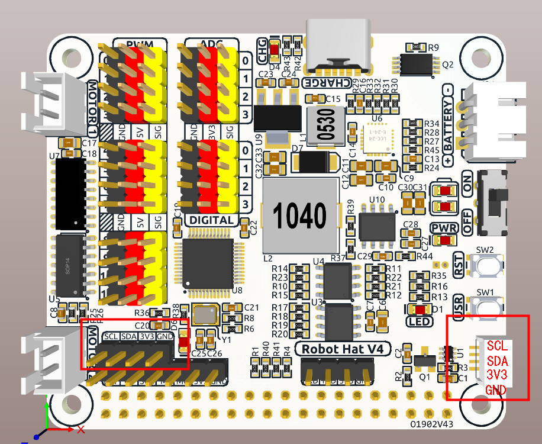
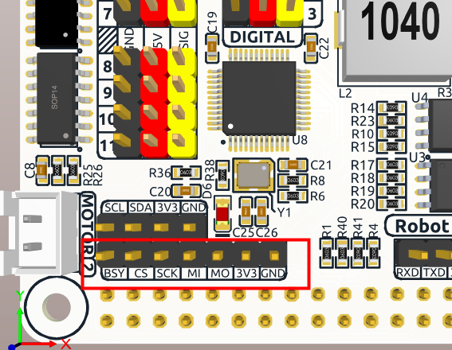
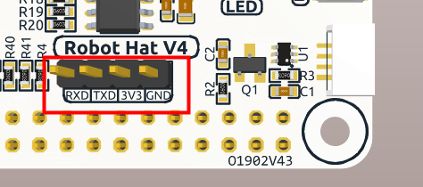

 .. note::

    Hello, welcome to the SunFounder Raspberry Pi & Arduino & ESP32 Enthusiasts Community on Facebook! Dive deeper into Raspberry Pi, Arduino, and ESP32 with fellow enthusiasts.

    **Why Join?**

    - **Expert Support**: Solve post-sale issues and technical challenges with help from our community and team.
    - **Learn & Share**: Exchange tips and tutorials to enhance your skills.
    - **Exclusive Previews**: Get early access to new product announcements and sneak peeks.
    - **Special Discounts**: Enjoy exclusive discounts on our newest products.
    - **Festive Promotions and Giveaways**: Take part in giveaways and holiday promotions.

    👉 Ready to explore and create with us? Click [|link_sf_facebook|] and join today!

Hardware Introduction
=========================

Pinout
---------------

**Power Port**
    * 6.0V-8.4V XH2.54 3pin power input.
    * Powering the Raspberry Pi and Robot HAT at the same time.

**Power Switch**
    * Turn on/off the power of the robot HAT.

**Type-C USB Port**
    * Insert the Type-C cable to charge the battery.
    * At the same time, the charging indicator lights up in red color.
    * When the battery is fully charged, the charging indicator turns off.
    * If the USB cable is still plugged in about 4 hours after it is fully charged, the charging indicator will blink to prompt.

**Digital Pin**
    * 4-channel digital pins, D0-D3.
    * Pin: :ref:`pin_digital`.
    * API: :ref:`class_pin`.

**ADC Pin**
    * 4-channel ADC pins, A0-A3.
    * Pin: :ref:`pin_adc`.
    * API: :ref:`class_adc`.

**PWM Pin**
    * 12-channel PWM pins, P0-P11.
    * Pin: :ref:`pin_pwm`.
    * API: :ref:`class_pwm`.

**Left/Right Motor Port**
    * 2-channel XH2.54 motor ports.
    * Pin: :ref:`pin_motor`.
    * API: :ref:`class_motor`, ``1`` for left motor port, ``2`` for right motor port.

**I2C Pin and I2C Port**
    * **I2C Pin**: P2.54 4-pin interface.
    * **I2C Port**: SH1.0 4-pin interface, which is compatible with QWIIC and STEMMA QT. 
    * These I2C interfaces are connected to the Raspberry Pi's I2C interface via GPIO2 (SDA) and GPIO3 (SCL).
    * Pin: :ref:`pin_i2c`.
    * API: :ref:`class_i2c`.

**SPI Pin**
    * P2.54 7-pin SPI interface.
    * Pin: :ref:`pin_spi`.

**UART Pin**
    * P2.54 4-pin interface.
    * Pin: :ref:`pin_uart`.

**RST Button**
    * The RST button, when using Ezblock, serves as a button to restart the Ezblock program. 
    * If not using Ezblock, the RST button does not have a predefined function and can be fully customized according to your needs.
    * Pin: :ref:`pin_button`.
    * API: :ref:`class_pin`

**USR Button**
    * The functions of USR Button can be set by your programming. (Pressing down leads to a input “0”; releasing produces a input “1”. ) 
    * API: :ref:`class_pin`, you can use ``Pin("SW")`` to define it.
    * Pin: :ref:`pin_button`.

**Battery Indicator**
    * Two LEDs light up when the voltage is higher than 7.6V.
    * One LED lights up in the 7.15V to 7.6V range. 
    * Below 7.15V, both LEDs turn off.
    * :ref:`battery_indicator`.

**Speaker and Speaker Port**
    * **Speaker**: This is a 2030 audio chamber speaker.
    * **Speaker Port**: The Robot HAT is equipped with onboard I2S audio output, along with a 2030 audio chamber speaker, providing a mono sound output.
    * Pin: :ref:`pin_speaker`.
    * API: :ref:`class_music`

Pin Mapping
------------------

.. list-table:: Raspberry Pi IO
    :widths: 50 50 50 50
    :header-rows: 1

    * - Robot Hat V4
      - Raspberry Pi
      - Raspberry Pi
      - Robot Hat V4
    * - NC
      - 3V3    
      - 5V
      - 5V
    * - SDA
      - SDA    
      - 5V
      - 5V
    * - SCL
      - SCL    
      - GND
      - GND
    * - D1
      - GPIO4    
      - TXD
      - TXD
    * - GND
      - GND    
      - RXD
      - RXD
    * - D0
      - GPIO17    
      - GPIO18
      - I2S BCLK
    * - D2
      - GPIO27    
      - GND
      - GND
    * - D3
      - GPIO22    
      - GPIO23
      - MOTOR 1 DIR
    * - NC
      - 3V3    
      - GPIO24
      - MOTOR 2 DIR
    * - SPI MOSI
      - MOSI    
      - GND
      - GND
    * - SPI MISO
      - MISO    
      - GPIO25
      - USR BUTTON
    * - SPI SCLK
      - SCLK    
      - CE0
      - SPI CE0
    * - GND
      - GND    
      - CE1
      - NC
    * - NC
      - ID_SD    
      - ID_SC
      - NC
    * - MCU Reset
      - GPIO5    
      - GND
      - GND
    * - (SPI)BSY 
      - GPIO6    
      - GPIO12
      - Board Identifier 2
    * - Board Identifier 1
      - GPIO13    
      - GND
      - GND
    * - I2S LRCLK
      - GPIO19    
      - GPIO16
      - RST BUTTON
    * - USER LED
      - GPIO26    
      - GPIO20
      - NC
    * - GND
      - GND    
      - GPIO21
      - I2S SDATA

.. _pin_digital:

Digital IO
---------------
    
Robot HAT has 4 sets of P2.54 3Pin digital pins.

.. list-table:: Digital IO
    :widths: 25 50
    :header-rows: 1

    * - Robot Hat V4
      - Raspberry Pi 

    * - D0
      - GPIO17

    * - D1
      - GPIO4

    * - D2
      - GPIO27

    * - D3
      - GPIO22

.. _pin_adc:

ADC
-------

.. image:: img/adcpin.png

The Robot HAT features four sets of 3Pin ADC (Analog to Digital Converter) pins, each spaced 2.54mm apart. These pins operate at a 3.3V power supply. The ADC function, offering 12-bit precision, is facilitated by an onboard microcontroller. Detailed instructions for reading ADC values are provided in the :ref:`on_board_mcu` section.

Also, ADC channel A4 is connected to the battery through a voltage divider using resistors, 
which will be used to measure the battery voltage to estimate the approximate battery charge.

The voltage divider ratio is 20K/10K, so:

* A4 voltage (Va4) = value_A4 / 4095.0 * 3.3
* Battery voltage (Vbat) = Va4*3
* Battery voltage (Vbat) = value_A4 / 4095.0 * 3.3 * 3

.. _pin_pwm:

PWM
--------

.. image:: img/pwmpin.png

Robot HAT has 4 sets of 3Pin PWM pins, each spaced 2.54mm apart, and the power supply is 5V.
The method of using the PWM is described in detail in :ref:`on_board_mcu`.

.. note:: PWM13 & 14 channels are used for motor drive.

.. _pin_i2c:

I2C
----------

The Robot HAT has two I2C interfaces. One is the P2.54 4-pin interface, and the other is the SH1.0 4-pin interface, which is compatible with QWIIC and STEMMA QT. 
These I2C interfaces are connected to the Raspberry Pi's I2C interface via GPIO2 (SDA) and GPIO3 (SCL). 
The board also features an :ref:`on_board_mcu`, and the two signal lines have 10K pull-up resistors.

.. _pin_spi:

SPI
---------

The SPI interface of the Robot HAT is a 7-pin P2.54 interface. 
It connects to the SPI interface of the Raspberry Pi and includes an additional I/O pin that can be used for purposes such as interrupts or resets.

.. list-table:: SPI
    :widths: 50 50
    :header-rows: 1

    * - Robot Hat V4
      - Raspberry Pi 
    * - BSY
      - GPIO6
    * - CS
      - CE0(GPIO8)
    * - SCK
      - SCLK(GPIO11)
    * - MI
      - MISO(GPIO9)
    * - MO
      - MOSI(GPIO10)
    * - 3V3
      - 3.3V Power
    * - GND
      - Ground

.. _pin_uart:

UART
----------

The UART interface of the Robot HAT is a 4-pin P2.54 interface. It connects to the Raspberry Pi's GPIO14 (TXD) and GPIO15 (RXD) pins.

.. _pin_button:

Buttons
----------------

The Robot HAT comes with 1 LED and 2 buttons, all directly connected to the Raspberry Pi's GPIO pins. 
The RST button, when using Ezblock, serves as a button to restart the Ezblock program. 
If not using Ezblock, the RST button does not have a predefined function and can be fully customized according to your needs.

.. list-table:: LED & Button
    :widths: 50 50
    :header-rows: 1

    * - Robot Hat V4
      - Raspberry Pi 
    * - LED
      - GPIO26
    * - USR
      - GPIO25
    * - RST
      - GPIO16

.. _pin_speaker:

Speaker and Speaker Port
----------------------------

The Robot HAT is equipped with onboard I2S audio output, along with a 2030 audio chamber speaker, providing a mono sound output.

.. list-table:: I2S
    :widths: 50 50
    :header-rows: 1

    * - I2S
      - Raspberry Pi
    * - LRCLK
      - GPIO19
    * - BCLK
      - GPIO18
    * - SDATA
      - GPIO21

.. _pin_motor:

Motor Port
-----------------

The motor driver of the Robot HAT supports 2 channels and can be controlled using 2 digital signals for direction and 2 PWM signals for speed control.

.. list-table:: Motor Driver
    :widths: 50 50
    :header-rows: 1

    * - Motor
      - IO
    * - Motor1 Dir
      - GPIO23
    * - Motor1 Power
      - PWM13
    * - Motor2 Dir
      - GPIO24
    * - Motor2 Power
      - PWM12

.. _battery_indicator:

Battery Level Indicator
------------------------------

The battery level indicator on the Robot HAT monitors the battery voltage using a voltage divider method and serves as a reference for estimating the battery level. 
The relationship between the LED and voltage is as follows:

.. list-table:: Battery Level
    :widths: 50 50
    :header-rows: 1

    * - LED Battery
      - Total Voltage
    * - 2 LEDs on
      - Greater than 7.6V
    * - 1 LED on
      - Greater than 7.15V
    * - Both LEDs off
      - Less than 7.15V

When any one of the batteries reaches or exceeds 4.1V while the others are below that threshold, 
the charging current of that specific battery will be reduced.

