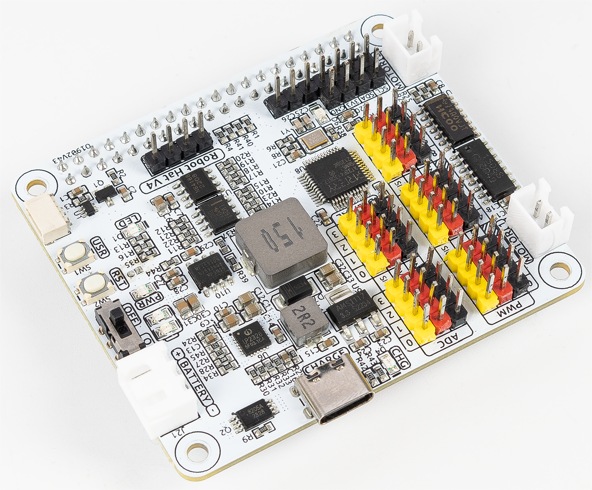

 .. note::

    Hello, welcome to the SunFounder Raspberry Pi & Arduino & ESP32 Enthusiasts Community on Facebook! Dive deeper into Raspberry Pi, Arduino, and ESP32 with fellow enthusiasts.

    **Why Join?**

    - **Expert Support**: Solve post-sale issues and technical challenges with help from our community and team.
    - **Learn & Share**: Exchange tips and tutorials to enhance your skills.
    - **Exclusive Previews**: Get early access to new product announcements and sneak peeks.
    - **Special Discounts**: Enjoy exclusive discounts on our newest products.
    - **Festive Promotions and Giveaways**: Take part in giveaways and holiday promotions.

    👉 Ready to explore and create with us? Click [|link_sf_facebook|] and join today!

SunFounder |link_Robot_HAT_kit|
=====================================

* |link_Robot_HAT|

Thanks for choosing our |link_Robot_HAT_kit|.

.. note::
    This document is available in the following languages.

        * |link_german_tutorials|
        * |link_jp_tutorials|
        * |link_en_tutorials|
    
    Please click on the respective links to access the document in your preferred language.

   

Robot HAT is a multifunctional expansion board that allows Raspberry Pi to be quickly turned into a robot. An MCU is on board to extend the PWM output and ADC input for the Raspberry Pi, as well as a motor driver chip, Bluetooth module, I2S audio module and mono speaker. As well as the GPIOs that lead out of the Raspberry Pi itself.

It also comes with a Speaker, which can be used to play background music, sound effects and implement TTS functions to make your project more interesting.

Accepts 6.0V-8.4V XH2.54 3pin power input with 2 power indicators. The board also has a user available LED and a button for you to quickly test some effects.

In this document, you will get a full understanding of the interface functions of the Robot HAT and the usage of these interfaces through the Python ``robot-hat`` library provided by SunFounder.

.. toctree::
    :maxdepth: 3

    About this HAT<self>
    features
    hardware_introduction
    battery
    installation
    install_i2s_for_speaker
    onboard_mcu
    api
    projects
    faq
