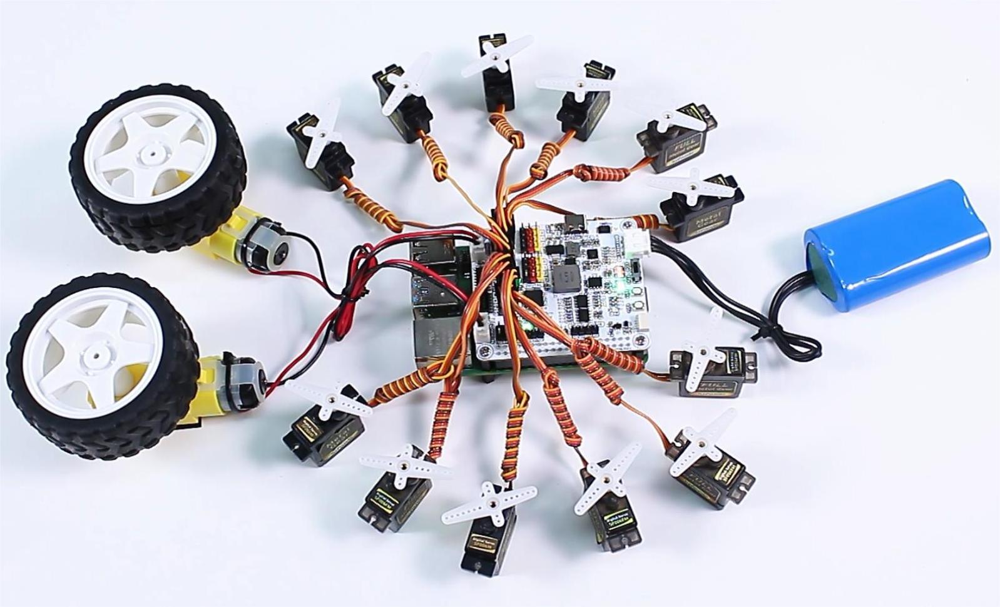

 .. note::

    Hello, welcome to the SunFounder Raspberry Pi & Arduino & ESP32 Enthusiasts Community on Facebook! Dive deeper into Raspberry Pi, Arduino, and ESP32 with fellow enthusiasts.

    **Why Join?**

    - **Expert Support**: Solve post-sale issues and technical challenges with help from our community and team.
    - **Learn & Share**: Exchange tips and tutorials to enhance your skills.
    - **Exclusive Previews**: Get early access to new product announcements and sneak peeks.
    - **Special Discounts**: Enjoy exclusive discounts on our newest products.
    - **Festive Promotions and Giveaways**: Take part in giveaways and holiday promotions.

    👉 Ready to explore and create with us? Click [|link_sf_facebook|] and join today!

Control Servos and Motors
============================

In this project, we have 12 servos and two motors working simultaneously.

However, it's important to note that if your servos and motors have a high starting current, it's recommended to start them separately to avoid insufficient power supply current, which could lead to the Raspberry Pi restarting.

**Code**

.. code-block:: python

    from robot_hat import Servo, Motors
    import time

    # Create objects for 12 servos
    servos = [Servo(f"P{i}") for i in range(12)]

    # Create motor object
    motors = Motors()

    def initialize_servos():
        """Set initial angle of all servos to 0."""
        for servo in servos:
            servo.angle(-90)
            time.sleep(0.1)  # Wait for servos to reach the initial position
        time.sleep(1)

    def sweep_servos(angle_from, angle_to, step):
        """Control all servos to sweep from a start angle to an end angle."""
        if angle_from < angle_to:
            range_func = range(angle_from, angle_to + 1, step)
        else:
            range_func = range(angle_from, angle_to - 1, -step)

        for angle in range_func:
            for servo in servos:
                servo.angle(angle)
            time.sleep(0.05)

    def control_motors_and_servos():
        """Control motors and servos in synchronization."""
        try:
            while True:
                # Motors rotate forward and servos sweep from -90 to 90 degrees
                motors[1].speed(80)
                time.sleep(0.01)
                motors[2].speed(80)
                time.sleep(0.01)
                sweep_servos(-90, 90, 5)
                time.sleep(1)

                # Motors rotate backward and servos sweep from 90 to -90 degrees
                motors[1].speed(-80)
                time.sleep(0.01)
                motors[2].speed(-80)
                time.sleep(0.01)
                sweep_servos(90, -90, 5)
                time.sleep(1)
        except KeyboardInterrupt:
            # Stop motors when Ctrl+C is pressed
            motors.stop()
            print("Motors stopped.")

    # Initialize servos to their initial position
    initialize_servos()

    # Control motors and servos
    control_motors_and_servos()

