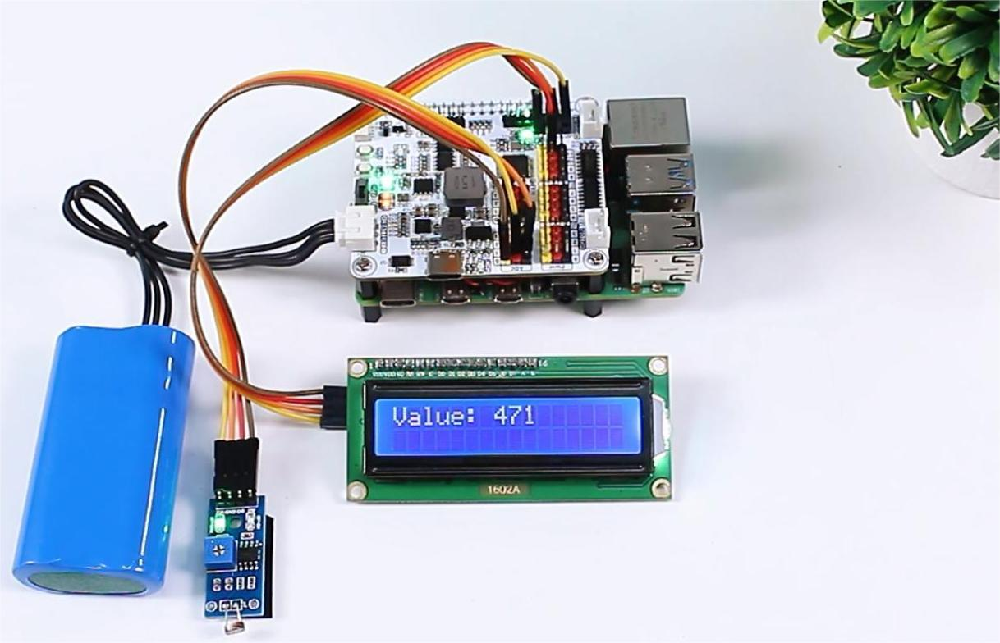

Read from Photoresistor Module
================================

In this project, we detect the light intensity and display on the I2C LCD1602.

**Steps**

#. In this project, an I2C LCD1602 is used, so it's necessary to download the relevant libraries to make it work.

    .. code-block:: shell

        cd ~/
        wget https://github.com/sunfounder/raphael-kit/blob/master/python/LCD1602.py

#. Install ``smbus2`` for I2C.

    .. code-block:: shell

        sudo pip3 install smbus2

#. Save the following code to your Raspberry Pi and give it a name, for example, ``photoresistor.ty``.

    .. code-block:: python

        from robot_hat import ADC
        import LCD1602
        import time

        # Create an ADC object to read the value from the photoresistor
        a0 = ADC(0)

        def setup():
            # Initialize the LCD1602
            LCD1602.init(0x27, 1)
            time.sleep(2)

        def destroy():
            # Clear the LCD display
            LCD1602.clear()

        def loop():
            while True:
                # Read the value from the photoresistor
                value0 = a0.read()
                # Display the read value on the LCD
                LCD1602.write(0, 0, 'Value: %d  ' % value0)
                # Reduce the refresh rate to update once per second
                time.sleep(0.2)

        if __name__ == '__main__':
            setup()
            try:
                loop()
            except KeyboardInterrupt:
                destroy()
            except Exception as e:
                # Clear the LCD and print error message in case of an exception
                destroy()
                print("Error:", e)

#. Use the command ``sudo python3 photoresistor.ty`` to run this code.

