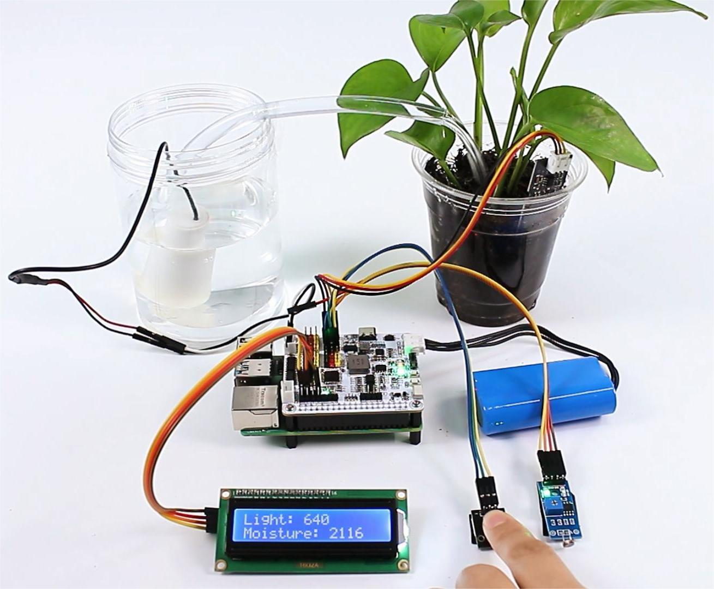

 .. note::

    Hello, welcome to the SunFounder Raspberry Pi & Arduino & ESP32 Enthusiasts Community on Facebook! Dive deeper into Raspberry Pi, Arduino, and ESP32 with fellow enthusiasts.

    **Why Join?**

    - **Expert Support**: Solve post-sale issues and technical challenges with help from our community and team.
    - **Learn & Share**: Exchange tips and tutorials to enhance your skills.
    - **Exclusive Previews**: Get early access to new product announcements and sneak peeks.
    - **Special Discounts**: Enjoy exclusive discounts on our newest products.
    - **Festive Promotions and Giveaways**: Take part in giveaways and holiday promotions.

    👉 Ready to explore and create with us? Click [|link_sf_facebook|] and join today!

Plant Monitor
======================

In this project, we detect both light intensity and soil moisture levels, and display them on the I2C LCD1602 . When you feel that the soil moisture is insufficient, you can press the button module to water the potted plant.

**Steps**

#. In this project, an I2C LCD1602 is used, so it's necessary to download the relevant libraries to make it work.

    .. code-block:: shell

        cd ~/
        wget https://github.com/sunfounder/raphael-kit/blob/master/python/LCD1602.py

#. Install ``smbus2`` for I2C.

    .. code-block:: shell

        sudo pip3 install smbus2

#. Save the following code to your Raspberry Pi and give it a name, for example, ``plant_monitor.ty``.

    .. code-block:: python

        from robot_hat import ADC, Motors, Pin
        import LCD1602
        import time
        import threading

        from robot_hat.utils import reset_mcu

        reset_mcu()
        time.sleep(.1)

        # Initialize objects
        light_sensor = ADC(1)
        moisture_sensor = ADC(0)
        motors = Motors()
        button = Pin('D0')

        # Thread running flag
        running = True

        def init_lcd():
            LCD1602.init(0x27, 1)
            time.sleep(2)

        def update_lcd(light_value, moisture_value):
            LCD1602.write(0, 0, 'Light: %d  ' % light_value)
            LCD1602.write(0, 1, 'Moisture: %d  ' % moisture_value)

        def read_sensors():
            light_value = light_sensor.read()
            time.sleep(0.2)
            moisture_value = moisture_sensor.read()
            time.sleep(0.2)
            return light_value, moisture_value

        def control_motor():
            global running
            while running:
                button_pressed = button.value() == 0
                if button_pressed:
                    motors[1].speed(80)
                    time.sleep(0.1)
                else:
                    motors[1].speed(0)
                    time.sleep(0.1)
                time.sleep(0.1)

        def setup():
            init_lcd()

        def destroy():
            global running
            running = False
            LCD1602.clear()

        def loop():
            global running
            while running:
                light_value, moisture_value = read_sensors()
                update_lcd(light_value, moisture_value)
                time.sleep(.2)

        if __name__ == '__main__':
            try:
                setup()
                motor_thread = threading.Thread(target=control_motor)
                motor_thread.start()
                loop()
            except KeyboardInterrupt:
                motor_thread.join()  # Wait for motor_thread to finish
                print("Program stopped")
            except Exception as e:
                print("Error:", e)
            finally:
                motors[1].speed(0)
                time.sleep(.1)
                destroy()
                print('end')

#. Use the command ``sudo python3 plant_monitor.ty`` to run this code.

