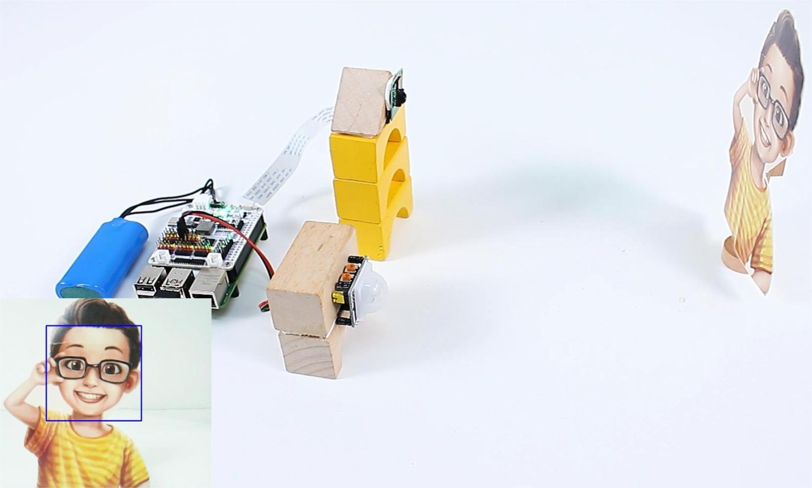

 .. note::

    Hello, welcome to the SunFounder Raspberry Pi & Arduino & ESP32 Enthusiasts Community on Facebook! Dive deeper into Raspberry Pi, Arduino, and ESP32 with fellow enthusiasts.

    **Why Join?**

    - **Expert Support**: Solve post-sale issues and technical challenges with help from our community and team.
    - **Learn & Share**: Exchange tips and tutorials to enhance your skills.
    - **Exclusive Previews**: Get early access to new product announcements and sneak peeks.
    - **Special Discounts**: Enjoy exclusive discounts on our newest products.
    - **Festive Promotions and Giveaways**: Take part in giveaways and holiday promotions.

    👉 Ready to explore and create with us? Click [|link_sf_facebook|] and join today!

Security System
=======================

In this project, we've created a simple security system. The PIR sensor detects if someone passes by, and then the camera activates. If a face is detected, it takes a picture and simultaneously delivers a warning message.

**Steps**

#. Install the ``vilib`` library for face detection.

    .. code-block:: shell

        cd ~/
        git clone -b picamera2 https://github.com/sunfounder/vilib.git
        cd vilib
        sudo python3 install.py

#. Save the following code to your Raspberry Pi and give it a name, for example, ``security.ty``.

    .. code-block:: python

        import os
        from time import sleep, time, strftime, localtime
        from vilib import Vilib
        from robot_hat import Pin, TTS

        # Initialize the TTS class
        tts = TTS(lang='en-US')

        # Display all supported languages
        print(tts.supported_lang())

        # Initialize the PIR sensor
        pir = Pin('D0')

        def camera_start():
            Vilib.camera_start()
            Vilib.display()
            Vilib.face_detect_switch(True)

        def take_photo():
            _time = strftime('%Y-%m-%d-%H-%M-%S', localtime(time()))
            name = f'photo_{_time}'
            username = os.getlogin()
            path = f"/home/{username}/Pictures/"
            Vilib.take_photo(name, path)
            print(f'Photo saved as {path}{name}.jpg')

        def main():
            motion_detected = False
            while True:
                # Check for motion
                if pir.value() == 1:
                    if not motion_detected:
                        print("Motion detected! Initializing camera...")
                        camera_start()
                        motion_detected = True
                        sleep(2)  # Stabilization delay to confirm motion

                    # Check for human face and take a photo
                    if Vilib.detect_obj_parameter['human_n'] != 0:
                        take_photo()
                        # Read the text
                        tts.say("Security alert: Unrecognized Individual detected. Please verify identity")
                        sleep(2)  # Delay after taking a photo

                # If no motion is detected, turn off the camera
                elif motion_detected:
                    print("No motion detected. Finalizing camera...")
                    Vilib.camera_close()
                    motion_detected = False
                    sleep(2)  # Delay before re-enabling motion detection

                sleep(0.1)  # Short delay to prevent CPU overuse

        def destroy():
            Vilib.camera_close()
            print("Camera and face detection stopped.")

        if __name__ == '__main__':
            try:
                main()
            except KeyboardInterrupt:
                destroy()

#. Use the command ``sudo python3 security.py`` to run this code.
    .. note::

        * :ref:`faq_speaker`

#. Open a web browser and enter ``http://rpi_ip:9000/mjpg`` to view the captured footage. Additionally, you can find the captured face images in ``/home/{username}/Pictures/``.

    .. image:: img/browser_camera.jpg

