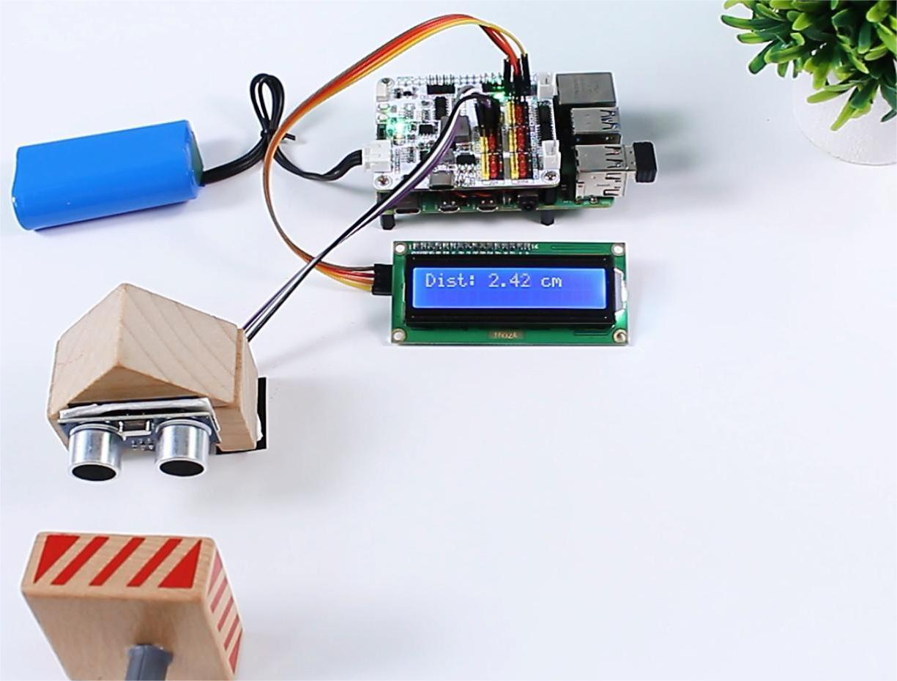

 .. note::

    Hello, welcome to the SunFounder Raspberry Pi & Arduino & ESP32 Enthusiasts Community on Facebook! Dive deeper into Raspberry Pi, Arduino, and ESP32 with fellow enthusiasts.

    **Why Join?**

    - **Expert Support**: Solve post-sale issues and technical challenges with help from our community and team.
    - **Learn & Share**: Exchange tips and tutorials to enhance your skills.
    - **Exclusive Previews**: Get early access to new product announcements and sneak peeks.
    - **Special Discounts**: Enjoy exclusive discounts on our newest products.
    - **Festive Promotions and Giveaways**: Take part in giveaways and holiday promotions.

    👉 Ready to explore and create with us? Click [|link_sf_facebook|] and join today!

Read from Ultrasonic Module
===============================

In this project, we use ultrasonic sensors to measure distance and display the readings on the I2C LCD1602.

**Steps**

#. In this project, an I2C LCD1602 is used, so it's necessary to download the relevant libraries to make it work.

    .. code-block:: shell

        cd ~/
        wget https://github.com/sunfounder/raphael-kit/blob/master/python/LCD1602.py

#. Install ``smbus2`` for I2C.

    .. code-block:: shell

        sudo pip3 install smbus2

#. Save the following code to your Raspberry Pi and give it a name, for example, ``ultrasonic.ty``.

    .. code-block:: python

        from robot_hat import ADC, Ultrasonic, Pin
        import LCD1602
        import time

        # Create ADC object for photoresistor
        a0 = ADC(0)

        # Create Ultrasonic object
        us = Ultrasonic(Pin("D2"), Pin("D3")) //Trig to digital pin 2, echo to pin 3

        def setup():
            # Initialize LCD1602
            LCD1602.init(0x27, 1)
            # Initial message on LCD
            LCD1602.write(0, 0, 'Measuring...')
            time.sleep(2)

        def destroy():
            # Clear the LCD display
            LCD1602.clear()

        def loop():
            while True:
                # Read distance from ultrasonic sensor
                distance = us.read()
                # Display the distance on the LCD
                if distance != -1:
                    # Display the valid distance on the LCD
                    LCD1602.write(0, 0, 'Dist: %.2f cm   ' % distance)
                
                # Update every 0.5 seconds
                time.sleep(0.2)

        if __name__ == '__main__':
            setup()
            try:
                loop()
            except KeyboardInterrupt:
                destroy()
            except Exception as e:
                # Clear the LCD and print error message in case of an exception
                destroy()
                print("Error:", e)

#. Use the command ``sudo python3 ultrasonic.ty`` to run this code.

