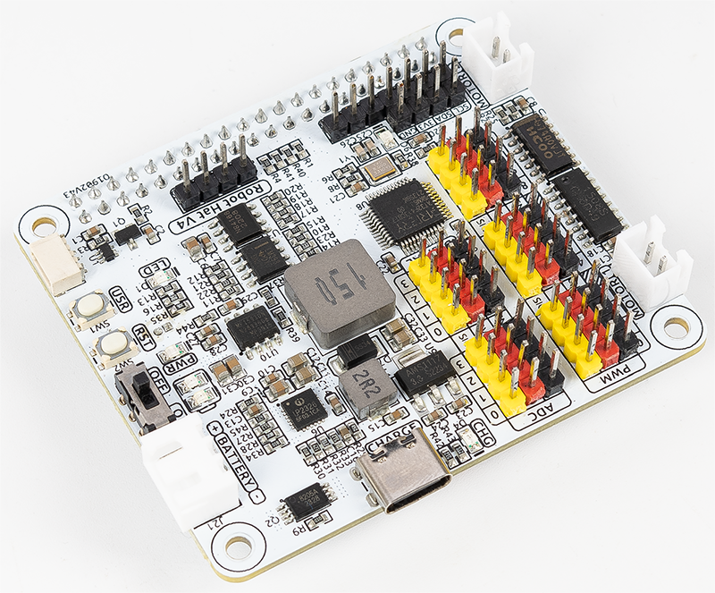

 .. note::

    Hello, welcome to the SunFounder Raspberry Pi & Arduino & ESP32 Enthusiasts Community on Facebook! Dive deeper into Raspberry Pi, Arduino, and ESP32 with fellow enthusiasts.

    **Why Join?**

    - **Expert Support**: Solve post-sale issues and technical challenges with help from our community and team.
    - **Learn & Share**: Exchange tips and tutorials to enhance your skills.
    - **Exclusive Previews**: Get early access to new product announcements and sneak peeks.
    - **Special Discounts**: Enjoy exclusive discounts on our newest products.
    - **Festive Promotions and Giveaways**: Take part in giveaways and holiday promotions.

    👉 Ready to explore and create with us? Click [|link_sf_facebook|] and join today!

SunFounder |link_Robot_HAT_kit|
=====================================

* |link_Robot_HAT|

Thanks for choosing our |link_Robot_HAT_kit|.

.. .. note::
..     This document is available in the following languages.

..         * |link_german_tutorials|
..         * |link_jp_tutorials|
..         * |link_en_tutorials|
    
..     Please click on the respective links to access the document in your preferred language.

   

The Robot HAT V4 is a powerful expansion board designed to transform the Raspberry Pi into a fully functional robot with minimal setup. With its onboard microcontroller (MCU), the Robot HAT V4 significantly enhances the Raspberry Pi’s capabilities by providing additional PWM outputs and ADC inputs—features not natively supported on most Raspberry Pi models.

This compact and versatile board integrates 2 motor driver chips, allowing for independent control of up to 2 DC motors. It also features an I2S digital audio module and a built-in mono speaker, enabling audio playback and interaction capabilities directly from the board.

The board accepts a 6.0V to 8.4V power input via a 3-pin XH2.54 connector. It includes two power indicator LEDs for monitoring system status, a user-programmable LED for custom signaling, and 2 convenient onboard buttons for quick function testing or input simulation. These hardware features make development and debugging more intuitive and efficient, particularly in robotics and automation projects.

Whether you're building an autonomous vehicle, a robotic arm, or a voice-interactive assistant, the Robot HAT V4 offers a robust and developer-friendly platform for rapid prototyping and innovation.

.. toctree::
    :maxdepth: 3

    features
    hardware_introduction
    onboard_mcu
    battery

