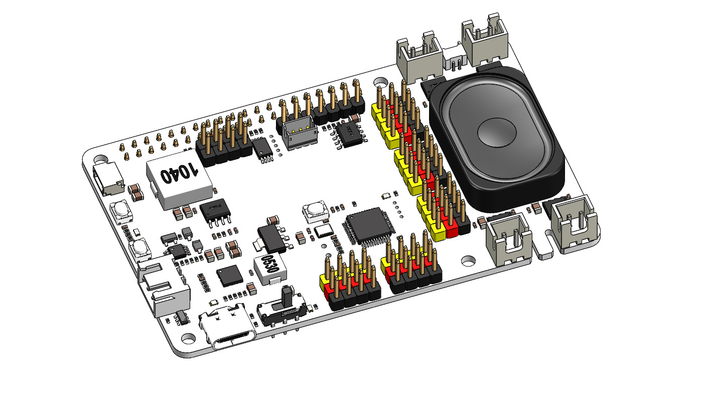

 .. note::

    Hello, welcome to the SunFounder Raspberry Pi & Arduino & ESP32 Enthusiasts Community on Facebook! Dive deeper into Raspberry Pi, Arduino, and ESP32 with fellow enthusiasts.

    **Why Join?**

    - **Expert Support**: Solve post-sale issues and technical challenges with help from our community and team.
    - **Learn & Share**: Exchange tips and tutorials to enhance your skills.
    - **Exclusive Previews**: Get early access to new product announcements and sneak peeks.
    - **Special Discounts**: Enjoy exclusive discounts on our newest products.
    - **Festive Promotions and Giveaways**: Take part in giveaways and holiday promotions.

    👉 Ready to explore and create with us? Click [|link_sf_facebook|] and join today!

Robot HAT V5
=====================================

* |link_Robot_HAT|

Thanks for choosing our |link_Robot_HAT_kit|.

.. .. note::
..     This document is available in the following languages.

..         * |link_german_tutorials|
..         * |link_jp_tutorials|
..         * |link_en_tutorials|
    
..     Please click on the respective links to access the document in your preferred language.

   

The Robot HAT V5 is a powerful and versatile expansion board designed to effortlessly transform a Raspberry Pi into a fully functional robot with minimal setup. Building upon the capabilities of its predecessor, the Robot HAT V4, the V5 version introduces enhanced hardware features and greater flexibility to support more advanced robotics and automation projects.

At the heart of the Robot HAT V5 is an onboard microcontroller (MCU), which significantly extends the Raspberry Pi’s native functionality by providing additional PWM outputs and ADC inputs—capabilities that are typically absent on standard Raspberry Pi models. This allows developers to achieve more precise motor control and sensor integration.

Compact in size yet rich in functionality, the Robot HAT V5 integrates four motor driver chips, supporting independent control of up to four DC motors. It also features a digital I2S audio module and a built-in mono speaker, enabling high-quality audio playback and interactive sound features directly from the board.

The board accepts a 6.0V to 8.4V power input via a 3-pin XH2.54 connector. It includes two power indicator LEDs for monitoring system status, a user-programmable LED for custom signaling, and two convenient onboard buttons for immediate function testing or input simulation—making development and debugging more efficient and user-friendly.

New to the V5 version is an onboard microphone, enabling voice recognition and audio interaction capabilities without the need for additional hardware. This enhancement simplifies the implementation of voice-controlled systems, opening up a wide range of intelligent applications. Another valuable addition is the “ZERO” button, which quickly resets the PWM outputs to the servo motor’s zero position. This feature makes servo calibration, assembly, and testing faster, easier, and more precise.

Whether you're developing an autonomous vehicle, robotic arm, or voice-interactive assistant, the Robot HAT V5 provides a robust, developer-friendly platform that empowers rapid prototyping and innovative robotics design.

.. toctree::
    :maxdepth: 3

    features
    hardware_introduction
    onboard_mcu
    battery

